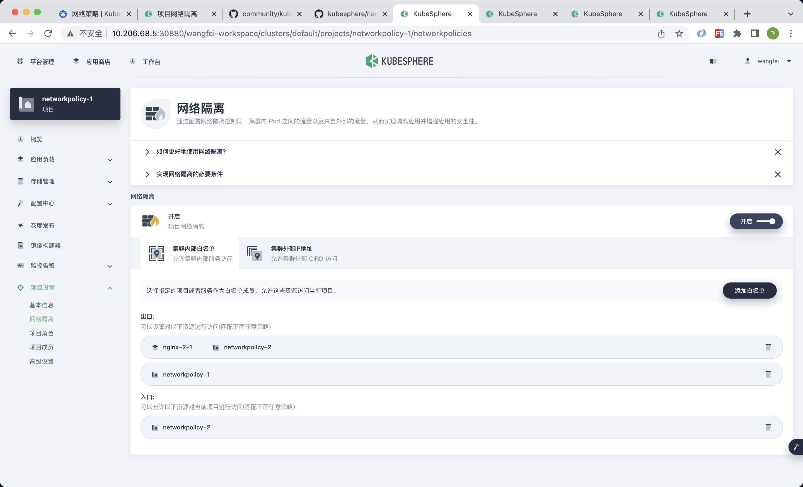
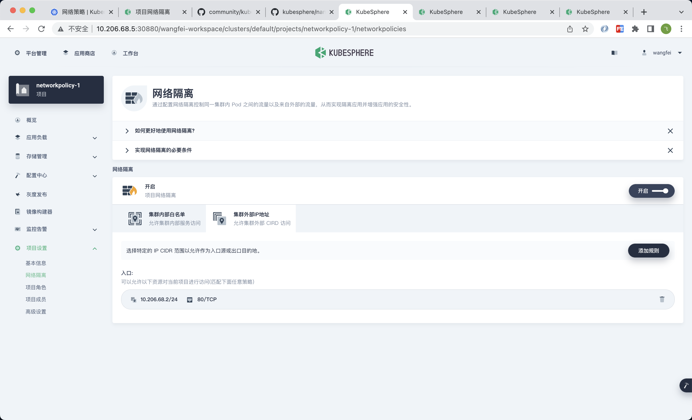

# [网络策略](https://v3-1.docs.kubesphere.io/zh/docs/pluggable-components/network-policy/)

## 实验前初始步骤

[项目网络隔离](https://v3-1.docs.kubesphere.io/zh/docs/project-administration/project-network-isolation/)

> 创建3个项目，每个项目下创建2个nginx应用：
> - networkpolicy-1
>   - nginx-1-1
>   - nginx-1-2
> - networkpolicy-2
>   - nginx-2-1
>   - nginx-2-2
> - networkpolicy-3
>   - nginx-3-1
>   - nginx-3-2

集群内部的流量

集群外部的入站流量

## 疑问

1. 疑问一
1.1 项目`networkpolicy-1`开启`网络隔离`
1.2 `平台管理`->`集群管理`->`网络管理`->`网络策略`中查看到自动生成的网络策略，手动修改yaml
1.3 一段时间后（几分钟）yaml文件内容恢复

> 不能手动修改`NetworkPolicy`资源？
