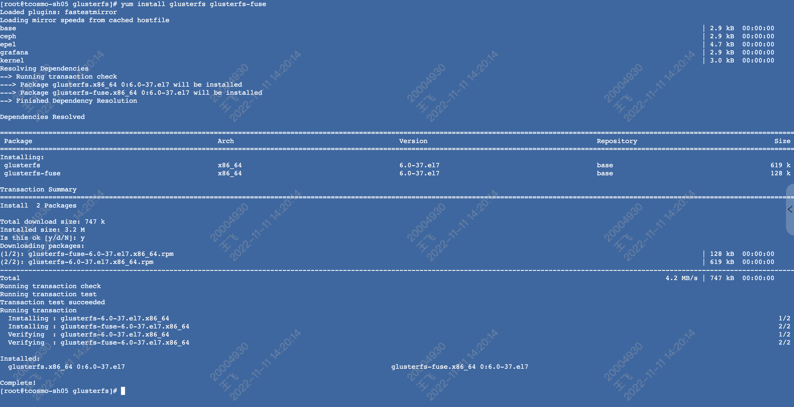

## 总结

### 准备工作

#### 虚拟磁盘创建法则

```shell
mkdir -p /mnt/sdb/vdisk
mkdir -p /mnt/vloop
dd if=/dev/zero of=raw.img bs=1G count=50
mkfs.xfs -q raw.img
mount -o loop /mnt/sdb/vdisk/raw.img /mnt/vloop
```

会报错误

```shell
Unable to add device: Initializing device /dev/sdb failed (already initialized or contains data?)
```

这时先

```shell
umount /dev/loop0
losetup /dev/loop0 raw.img
```

如果是缺少命令的话 在 lvm2 包里。
然后执行
```shell
parted /dev/loop0
pvcreate /dev/loop0
```

#### 各个k8s集群节点上安装glusterfs



```shell
[root@tcosmo-sh05 glusterfs]# yum install glusterfs glusterfs-fuse
Loaded plugins: fastestmirror
Loading mirror speeds from cached hostfile
base                                                                                                                                                                          | 2.9 kB  00:00:00     
ceph                                                                                                                                                                          | 2.9 kB  00:00:00     
epel                                                                                                                                                                          | 4.7 kB  00:00:00     
grafana                                                                                                                                                                       | 2.9 kB  00:00:00     
kernel                                                                                                                                                                        | 3.0 kB  00:00:00     
Resolving Dependencies
--> Running transaction check
---> Package glusterfs.x86_64 0:6.0-37.el7 will be installed
---> Package glusterfs-fuse.x86_64 0:6.0-37.el7 will be installed
--> Finished Dependency Resolution

Dependencies Resolved

=====================================================================================================================================================================================================
 Package                                              Arch                                         Version                                          Repository                                  Size
=====================================================================================================================================================================================================
Installing:
 glusterfs                                            x86_64                                       6.0-37.el7                                       base                                       619 k
 glusterfs-fuse                                       x86_64                                       6.0-37.el7                                       base                                       128 k

Transaction Summary
=====================================================================================================================================================================================================
Install  2 Packages

Total download size: 747 k
Installed size: 3.2 M
Is this ok [y/d/N]: y
Downloading packages:
(1/2): glusterfs-fuse-6.0-37.el7.x86_64.rpm                                                                                                                                   | 128 kB  00:00:00     
(2/2): glusterfs-6.0-37.el7.x86_64.rpm                                                                                                                                        | 619 kB  00:00:00     
-----------------------------------------------------------------------------------------------------------------------------------------------------------------------------------------------------
Total                                                                                                                                                                4.2 MB/s | 747 kB  00:00:00     
Running transaction check
Running transaction test
Transaction test succeeded
Running transaction
  Installing : glusterfs-6.0-37.el7.x86_64                                                                                                                                                       1/2 
  Installing : glusterfs-fuse-6.0-37.el7.x86_64                                                                                                                                                  2/2 
  Verifying  : glusterfs-6.0-37.el7.x86_64                                                                                                                                                       1/2 
  Verifying  : glusterfs-fuse-6.0-37.el7.x86_64                                                                                                                                                  2/2 

Installed:
  glusterfs.x86_64 0:6.0-37.el7                                                                  glusterfs-fuse.x86_64 0:6.0-37.el7                                                                 

Complete!
[root@tcosmo-sh05 glusterfs]# glusterfs
USAGE: glusterfs [options] [mountpoint]
[root@tcosmo-sh05 glusterfs]#
```

#### 各个节点打上`storagenode=glusterfs`

```shell
[root@tcosmo-sh05 glusterfs]# kubectl label node tcosmo-sh01 storagenode=glusterfs
[root@tcosmo-sh05 glusterfs]# kubectl label node tcosmo-sh05 storagenode=glusterfs
[root@tcosmo-sh05 glusterfs]# kubectl label node tcosmo-sh06 storagenode=glusterfs
[root@tcosmo-sh05 glusterfs]# 
[root@tcosmo-sh05 glusterfs]# kubectl get node --show-labels
NAME          STATUS   ROLES                  AGE   VERSION   LABELS
tcosmo-sh01   Ready    worker                 33d   v1.20.4   beta.kubernetes.io/arch=amd64,beta.kubernetes.io/os=linux,kubernetes.io/arch=amd64,kubernetes.io/hostname=tcosmo-sh01,kubernetes.io/os=linux,node-role.kubernetes.io/worker=,storagenode=glusterfs
tcosmo-sh05   Ready    control-plane,master   33d   v1.20.4   beta.kubernetes.io/arch=amd64,beta.kubernetes.io/os=linux,kubernetes.io/arch=amd64,kubernetes.io/hostname=tcosmo-sh05,kubernetes.io/os=linux,node-role.kubernetes.io/control-plane=,node-role.kubernetes.io/master=,storagenode=glusterfs
tcosmo-sh06   Ready    worker                 33d   v1.20.4   beta.kubernetes.io/arch=amd64,beta.kubernetes.io/os=linux,kubernetes.io/arch=amd64,kubernetes.io/hostname=tcosmo-sh06,kubernetes.io/os=linux,node-role.kubernetes.io/worker=,storagenode=glusterfs
```

### glusterfs-daemonset.yaml

#### 缺少下面字段，必须加上

```yaml
spec:
  # 需添加该字段
  selector:
    matchLabels:
      glusterfs-node: pod
```

#### 创建glusterfs管理服务容器集群

```shell
[root@tcosmo-sh05 glusterfs]# kubectl create -f glusterfs-daemonset.yaml 
daemonset.apps/glusterfs created
[root@tcosmo-sh05 glusterfs]#
[root@tcosmo-sh05 glusterfs]# kubectl get daemonset
NAME        DESIRED   CURRENT   READY   UP-TO-DATE   AVAILABLE   NODE SELECTOR           AGE
glusterfs   3         3         3       3            3           storagenode=glusterfs   2m20s
[root@tcosmo-sh05 glusterfs]# 
[root@tcosmo-sh05 glusterfs]# kubectl get pod
NAME              READY   STATUS    RESTARTS   AGE
glusterfs-5qggt   1/1     Running   0          2m30s
glusterfs-sx227   1/1     Running   0          2m30s
glusterfs-zqwpv   1/1     Running   0          2m30s
[root@tcosmo-sh05 glusterfs]#
```

### heketi-rbac.yaml

#### 创建`ServiceAccount`并完成`RBAC`授权

```shell
[root@tcosmo-sh05 glusterfs]# kubectl create -f heketi-rbac.yaml
serviceaccount/heketi-service-account created
role.rbac.authorization.k8s.io/heketi created
rolebinding.rbac.authorization.k8s.io/heketi created
[root@tcosmo-sh05 glusterfs]#
```

#### 部署`heketi`服务

```shell
[root@tcosmo-sh05 glusterfs]# kubectl create -f heketi-deployment-svc.yaml 
deployment.apps/heketi created
service/heketi created
[root@tcosmo-sh05 glusterfs]#
```

#### 进入`heketi`的`pod`内
```shell
[root@tcosmo-sh05 ~]# kubectl exec -it heketi-868879cf95-zc445 -- /bin/sh
sh-5.1# export HEKETI_CLI_SERVER=http://localhost:8080
```

#### 拷贝`topology.json`至`heketi`的`pod`内

```shell
[root@tcosmo-sh05 glusterfs]# kubectl cp topology.json heketi-868879cf95-6jlq9:/opt/
[root@tcosmo-sh05 glusterfs]#
```

#### 查看拷贝结果

```shell
sh-5.1# cd /opt/
sh-5.1# ls
topology.json
sh-5.1# 
```

#### 查看`heketi`的`token`

```shell
sh-5.1# cat /etc/heketi/heketi.json
{
        "_port_comment": "Heketi Server Port Number",
        "port" : "8080",

        "_use_auth": "Enable JWT authorization. Please enable for deployment",
        "use_auth" : false,

        "_jwt" : "Private keys for access",
        "jwt" : {
                "_admin" : "Admin has access to all APIs",
                "admin" : {
                        "key" : "My Secret"
                },
                "_user" : "User only has access to /volumes endpoint",
                "user" : { 
                        "key" : "My Secret"
                }
        },

        "_glusterfs_comment": "GlusterFS Configuration",
        "glusterfs" : {

                "_executor_comment": "Execute plugin. Possible choices: mock, ssh",
                "executor" : "mock",

                "_db_comment": "Database file name",
                "db" : "/var/lib/heketi/heketi.db"
        }
}
sh-5.1# 
```

#### 执行`heketi-cli`完成集群`glusterfs`的创建

> 注意参数`--user admin --secret 'My Secret'`

```shell
sh-5.1# heketi-cli topology load --json=topology.json --user admin --secret 'My Secret'
Creating cluster ... ID: e41292be3d8d90a34a7aab03ca2a3394
        Allowing file volumes on cluster.
        Allowing block volumes on cluster.
        Creating node tcosmo-sh01 ... ID: ed449f1e64399370dea84382e5524cc6
                Adding device /dev/loop0 ... Unable to add device: Initializing device /dev/loop0 failed (already initialized or contains data?):   Device /dev/loop0 not found.
        Creating node tcosmo-sh05 ... ID: b9b5620715de076c78a3dded4a1edc54
                Adding device /dev/loop0 ... Unable to add device: Initializing device /dev/loop0 failed (already initialized or contains data?):   Device /dev/loop0 not found.
        Creating node tcosmo-sh06 ... ID: e7d82ed19d9051ebf0f39f01a5fc1b70
                Adding device /dev/loop0 ... Unable to add device: Initializing device /dev/loop0 failed (already initialized or contains data?):   Device /dev/loop0 not found.
sh-5.1#
```

#### 查看`heketi`的`topology`信息, 可以看到node和device的详细信息

```shell

```

### storageclass-gluster-heketi.yaml

参考[https://blog.csdn.net/qq_15138049/article/details/122450353](https://blog.csdn.net/qq_15138049/article/details/122450353)

1. 添加`Secret`, `StorageClass`中`parameters`: `restauthenabled`, `volumetype`等。这样`pvc`状态才`Bound`, 否则一直`Pending`.

- `resturl`设置为 API Server 所在主机可以访问到的heketi服务地址，可以使用 ClusterIP+Port、PodIP+Port，或将服务映射到物理机，使用NodeIP+NodePort。
- `clusterid`为集群id
```shell
---
apiVersion: v1
kind: Secret
type: kubernetes.io/glusterfs
metadata:
  name: heketi-secret
  #namespace: kube-system
data:
  # base64 encoded. key=My Secret
  key: TXkgU2VjcmV0

---
apiVersion: storage.k8s.io/v1
kind: StorageClass
metadata:
  name: gluster-heketi
provisioner: kubernetes.io/glusterfs
parameters:
  resturl: "http://10.233.22.219:8080"
  restauthenabled: "true"
  volumetype: "none"
  restuser: "admin"
  secretName: "heketi-secret"
  secretNamespace: "default"
  clusterid: "cfb5c3eb1d34ae61668eb3da475d23d0"
```

2. 所有节点!!!

```shell
modprobe dm_snapshot
modprobe dm_mirror
modprobe dm_thin_pool
```

#### 创建`StorageClass`

```shell
[root@tcosmo-sh05 glusterfs]# kubectl create -f storageclass-gluster-heketi.yaml 
secret/heketi-secret created
storageclass.storage.k8s.io/gluster-heketi created
[root@tcosmo-sh05 glusterfs]#
```

### pvc-gluster-heketi.yaml

```yaml
apiVersion: v1
kind: PersistentVolumeClaim
metadata:
  name: pvc-gluster-heketi
spec:
  storageClassName: gluster-heketi
  accessModes:
    - ReadWriteOnce
  resources:
    requests:
      storage: 1Gi

```

#### 定义PVC申请glusterfs存储空间，申请1GB空间，设置StorageClass为gluster-heketi，未设置Selector表示使用动态资源供应模式。

```shell
[root@tcosmo-sh05 glusterfs]# kubectl create -f pvc-gluster-heketi.yaml 
persistentvolumeclaim/pvc-gluster-heketi created
[root@tcosmo-sh05 glusterfs]#
```

#### PVC的定义一旦生成，系统便将触发heketi进行相应的操作，主要为在glusterfs集群中创建brick，再创建并启动一个volume。可以在heketi的日志中查看整个过程。

```shell

```

#### 查看PVC详情，确认状态为Bound（已绑定）

```shell

```

#### 查看PV，可以看到系统通过动态供应机制系统自动创建的PV

```shell
kubectl get pv

```

#### 查看PV详情

```shell
kubectl describe pv pvc-*****
```

> 至此一个可供Pod使用的PVC就创建成功了，接下来Pod就能通过Volume的设置将这个PVC挂载到容器内部进行使用了。

### pod-use-pvc.yaml

在Pod中使用PVC定义的存储资源的配置，首先设置一个类型为persistentVolumeClaim的Volume，然后将其通过volumeMounts设置挂载到容器内的目录路径下，注意，Pod需要与PVC同属一个命名空间。

```shell
kubectl create -f pod-use-pvc.yaml
```

```shell
kubectl exec -it pod*** -- /bin/sh
```

### 相关操作命令

1. 进入`heketi`的`pod`内
```shell
[root@tcosmo-sh05 ~]# kubectl exec -it heketi-868879cf95-zc445 -- /bin/sh
sh-5.1# export HEKETI_CLI_SERVER=http://localhost:8080
```

2. 查看heketi的topology info
```shell
sh-5.1# heketi-cli -s $HEKETI_CLI_SERVER --user admin --secret 'My Secret' topology info

Cluster Id: cfb5c3eb1d34ae61668eb3da475d23d0

    File:  true
    Block: true

    Volumes:

        Name: vol_4756c3ac5f250b63a2b72561d838e825
        Size: 1
        Id: 4756c3ac5f250b63a2b72561d838e825
        Cluster Id: cfb5c3eb1d34ae61668eb3da475d23d0
        Mount: 10.206.68.5:vol_4756c3ac5f250b63a2b72561d838e825
        Mount Options: backup-volfile-servers=10.206.68.6,10.206.68.1
        Durability Type: none
        Snapshot: Enabled
        Snapshot Factor: 1.00

                Bricks:
                        Id: 699ce82575c13fd9475e6d4c97bebf6d
                        Path: /var/lib/heketi/mounts/vg_8a654e0bafddfc54e571a6b62c43189c/brick_699ce82575c13fd9475e6d4c97bebf6d/brick
                        Size (GiB): 1
                        Node: 826d48510645f91f6d678951bb68b890
                        Device: 8a654e0bafddfc54e571a6b62c43189c


    Nodes:

        Node Id: 826d48510645f91f6d678951bb68b890
        State: online
...
```

3. 查看heketi的volume list
```shell
sh-5.1# heketi-cli -s $HEKETI_CLI_SERVER --user admin --secret 'My Secret' volume list  
Id:4756c3ac5f250b63a2b72561d838e825    Cluster:cfb5c3eb1d34ae61668eb3da475d23d0    Name:vol_4756c3ac5f250b63a2b72561d838e825
```

4. 查看heketi的volume info
```shell
sh-5.1# heketi-cli -s $HEKETI_CLI_SERVER --user admin --secret 'My Secret' volume info 4756c3ac5f250b63a2b72561d838e825 
Name: vol_4756c3ac5f250b63a2b72561d838e825
Size: 1
Volume Id: 4756c3ac5f250b63a2b72561d838e825
Cluster Id: cfb5c3eb1d34ae61668eb3da475d23d0
Mount: 10.206.68.5:vol_4756c3ac5f250b63a2b72561d838e825
Mount Options: backup-volfile-servers=10.206.68.6,10.206.68.1
Block: false
Free Size: 0
Reserved Size: 0
Block Hosting Restriction: (none)
Block Volumes: []
Durability Type: none
Distribute Count: 1
Snapshot Factor: 1.00
```

5. 创建、进入使用pvc的pod中
```shell
[root@tcosmo-sh05 ~]# kubectl exec -it pod-use-pvc -- /bin/sh
/ # ls
bin      dev      etc      home     proc     pv-data  root     sys      tmp      usr      var
/ # cd /pv-data/
/pv-data # ls
/pv-data # touch a
/pv-data # echo 'hello' > b
/pv-data # ls
a  b
```

6. 挂载成功
```shell
[root@tcosmo-sh05 testpvc]# mount -t glusterfs 10.206.68.5:vol_4756c3ac5f250b63a2b72561d838e825 /root/KubeSphere/glusterfs/testpvc
[root@tcosmo-sh05 glusterfs]# tree testpvc/
testpvc/
├── a
└── b

0 directories, 2 files
```
